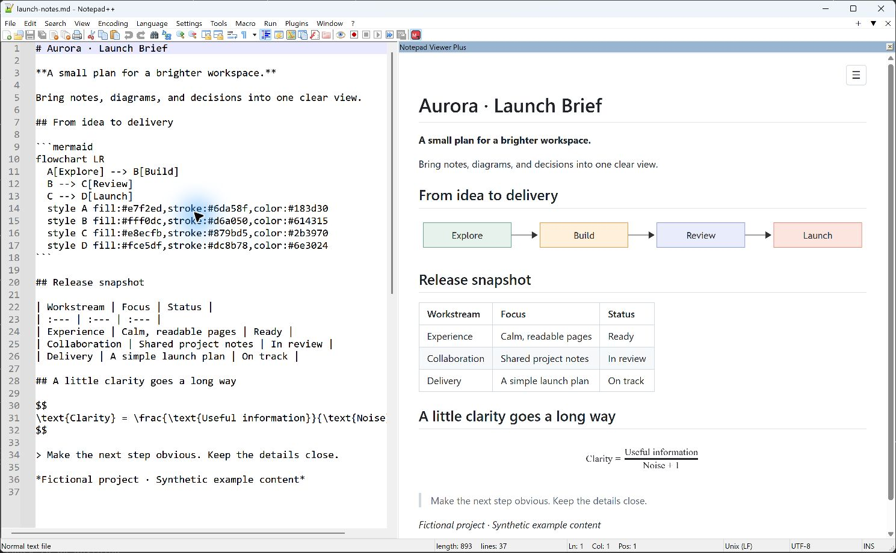
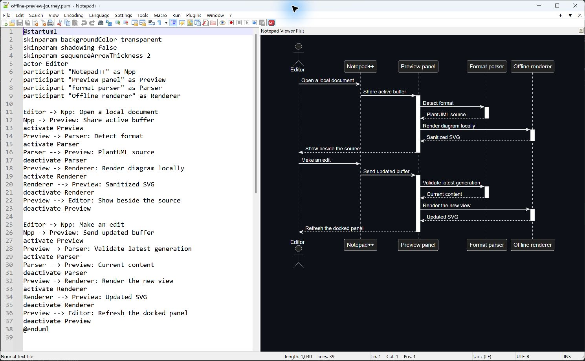
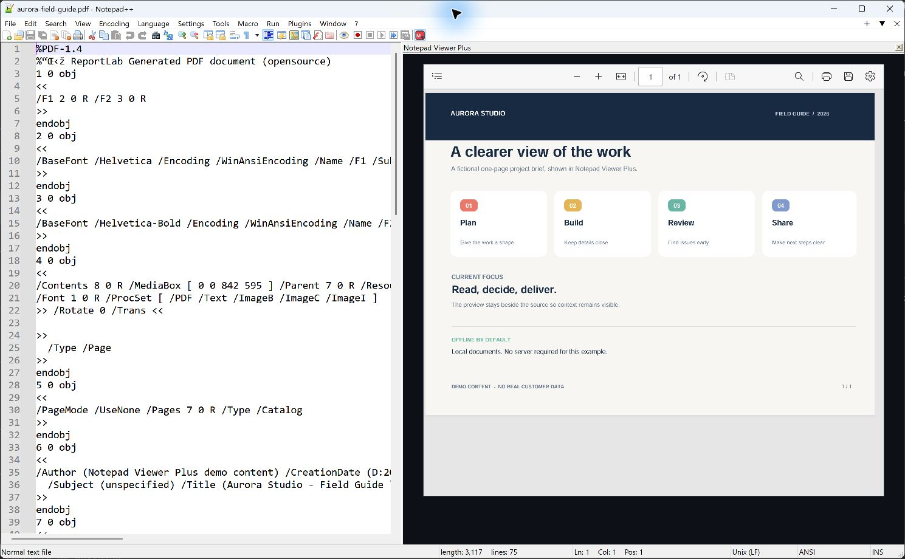
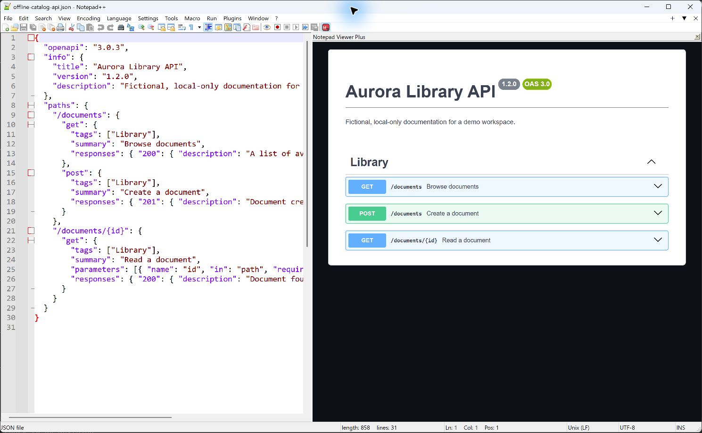

# Notepad Viewer Plus

An offline, docked multi-format preview for Windows Notepad++.

This is the **0.4.0 public evaluation prerelease**. It is free to download and try while the [Plugin List draft PR](https://github.com/notepad-plus-plus/nppPluginList/pull/1209) is reviewed.

## Download

Choose the package that matches your Notepad++ architecture. In Notepad++, open **Help → About Notepad++** to check it.

| Notepad++ | Package |
| --- | --- |
| 64-bit | [Download NotepadViewerPlus-0.4.0-x64.zip](https://github.com/Duclevn/notepad-viewer-plus-releases/releases/download/v0.4.0/NotepadViewerPlus-0.4.0-x64.zip) |
| 32-bit | [Download NotepadViewerPlus-0.4.0-x86.zip](https://github.com/Duclevn/notepad-viewer-plus-releases/releases/download/v0.4.0/NotepadViewerPlus-0.4.0-x86.zip) |

See [SHA256SUMS.txt](SHA256SUMS.txt) for download checksums. ARM64 is not supported.

## What you can preview

- Markdown with syntax highlighting, math, and a table of contents.
- Mermaid and PlantUML diagrams rendered with local assets.
- Sanitized HTML and SVG.
- JSON, YAML, and XML trees.
- CSV and TSV tables.
- OpenAPI documents, images, and PDF files.

The preview opens as a docked panel and includes a toolbar toggle, keyboard shortcut, and light/dark/system theme handling. Rendering is offline by default, with an optional setting for HTTPS images.

## Screenshots

These screenshots were captured from Notepad Viewer Plus 0.4.0 running inside Notepad++ 8.9.8.1. The example documents are fictional. Open an image to see it at full size.

_Markdown, Mermaid, tables, and math in the real 0.4.0 UI. The “Aurora” project is fictional._

_PlantUML sequence diagram rendered locally beside its source._

_A fictional project brief in the built-in PDF viewer._

_OpenAPI documentation for a fictional library service, rendered without a server._

## Known limitation

Some math expressions may need a refresh after the initial render or resizing the preview pane. Use **Plugins → Notepad Viewer Plus → Refresh Preview**, or hide and show the panel.

## Requirements

- Windows with a matching 64-bit or 32-bit Notepad++ installation.
- [Microsoft Edge WebView2 Evergreen Runtime](https://developer.microsoft.com/en-us/microsoft-edge/webview2).
- [Microsoft Visual C++ v14 Redistributable](https://learn.microsoft.com/en-us/cpp/windows/latest-supported-vc-redist) matching the plugin architecture.

Both packages were exercised in isolated Notepad++ 8.9.8.1 hosts. The x86 package also passed a focused Plugin Admin debug install, update, and removal flow. This prerelease does not claim a wider supported-version range.

## Install manually

The short version is:

1. Save your work and close every Notepad++ window.
2. Download the matching ZIP above and extract the **entire package** into `<Notepad++>\plugins\NotepadViewerPlus\`.
3. Confirm that `NotepadViewerPlus.dll` is directly in that folder and that `assets\` is beside it.
4. Restart Notepad++. Open **Plugins → Notepad Viewer Plus → Toggle Preview**, press **Ctrl+Alt+P**, or use the toolbar button.

Read the complete [manual installation guide](docs/INSTALLATION.md) for standard and portable paths, Windows download handling, upgrades, removal, and troubleshooting. The steps follow the [official Notepad++ manual installation guidance](https://npp-user-manual.org/docs/plugins/#install-plugin-manually), with the [official source documentation](https://github.com/notepad-plus-plus/npp-usermanual/blob/master/content/docs/plugins.md) available as a fallback reference.

Do not use **Import plugin(s)** to copy only the DLL. This plugin needs its renderer assets and included notices alongside the DLL.

## Plugin Admin

The plugin is not available in Plugin Admin yet. The [x64 Plugin List draft PR #1209](https://github.com/notepad-plus-plus/nppPluginList/pull/1209) is open for maintainer review. After an entry is accepted and appears in Plugin Admin, the [installation guide](docs/INSTALLATION.md#install-after-plugin-admin-acceptance) explains the normal **Plugins → Plugins Admin** flow.

## Updates and removal

Close Notepad++ before upgrading. Keep a backup of the existing `NotepadViewerPlus` folder, then replace it with the complete new ZIP contents. To remove the plugin, close Notepad++ and delete only its `plugins\NotepadViewerPlus\` folder.

## Terms and source

This evaluation package is provided free for download, installation, and running. The limited review permission is described in [REVIEW-TERMS.md](REVIEW-TERMS.md). The broader proposed terms for personal/business use and redistribution of complete unchanged packages remain conditional on the [licensing clarification in issue #28](https://github.com/npp-plugins/plugintemplate/issues/28). Third-party notices and license texts are included in the ZIP; no project license or GPL exception is claimed here.

The preferred C++ and TypeScript source repository remains private. The shipped renderer assets are necessarily present in the package and can be inspected.

## Help and feedback

Report evaluation issues in the [release repository issue tracker](https://github.com/Duclevn/notepad-viewer-plus-releases/issues). Include the plugin version, Notepad++ version and architecture, WebView2 version, and a small non-sensitive example. Start with [INSTALLATION.md](docs/INSTALLATION.md) if the plugin does not appear or the preview is blank.
