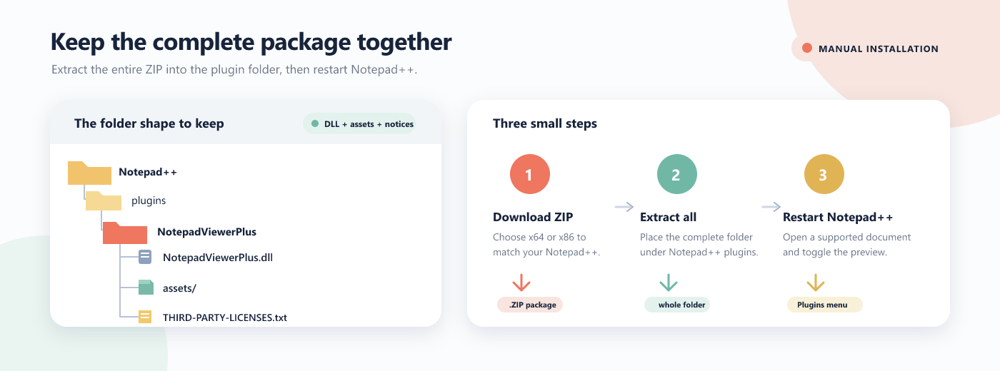

# Install Notepad Viewer Plus

This guide covers the 0.4.0 evaluation packages for Windows Notepad++. It uses the same folder layout expected by the official Notepad++ manual.



_The complete package keeps the DLL, renderer assets, and notices together._

## Before you begin

You need:

- A 64-bit or 32-bit Windows installation of Notepad++.
- [Microsoft Edge WebView2 Evergreen Runtime](https://developer.microsoft.com/en-us/microsoft-edge/webview2).
- [Microsoft Visual C++ v14 Redistributable](https://learn.microsoft.com/en-us/cpp/windows/latest-supported-vc-redist) matching the Notepad++ architecture.

ARM64 is not supported. Both packages were exercised in isolated Notepad++ 8.9.8.1 hosts. The x86 package also passed a focused Plugin Admin debug install, update, and removal flow.

The official reference is [Install a plugin manually](https://npp-user-manual.org/docs/plugins/#install-plugin-manually). The [Notepad++ user manual source](https://github.com/notepad-plus-plus/npp-usermanual/blob/master/content/docs/plugins.md) is also available if the rendered manual is unavailable.

## 1. Check your Notepad++ architecture

In Notepad++, open **Help → About Notepad++**. Choose the x64 ZIP for 64-bit Notepad++ and the x86 ZIP for 32-bit Notepad++.

Do not install an x64 plugin into a 32-bit Notepad++ installation, or the reverse.

## 2. Download the complete package

- [NotepadViewerPlus-0.4.0-x64.zip](https://github.com/Duclevn/notepad-viewer-plus-releases/releases/download/v0.4.0/NotepadViewerPlus-0.4.0-x64.zip)
- [NotepadViewerPlus-0.4.0-x86.zip](https://github.com/Duclevn/notepad-viewer-plus-releases/releases/download/v0.4.0/NotepadViewerPlus-0.4.0-x86.zip)

Save the ZIP from a trusted source. If Windows shows an **Unblock** checkbox in the ZIP's **Properties**, select it and choose **Apply** before extracting. If Windows still marks the extracted DLL as blocked, open the DLL's **Properties**, select **Unblock** if available, and apply the change. Only unblock files you trust.

## 3. Close Notepad++

Save your work and close every Notepad++ window before copying or replacing plugin files. Notepad++ must not be running while you install or upgrade the plugin.

## 4. Extract the entire ZIP

Extract the package into the `plugins\NotepadViewerPlus\` directory under your Notepad++ installation. The folder must be named exactly `NotepadViewerPlus`.

Typical paths are:

| Installation | Plugin directory |
| --- | --- |
| 64-bit installed Notepad++ | `C:\Program Files\Notepad++\plugins\NotepadViewerPlus\` |
| 32-bit installed Notepad++ | `C:\Program Files (x86)\Notepad++\plugins\NotepadViewerPlus\` |
| Portable or custom installation | `<Notepad++>\plugins\NotepadViewerPlus\` |

The resulting layout should look like this:

```text
<Notepad++>\
└── plugins\
    └── NotepadViewerPlus\
        ├── NotepadViewerPlus.dll
        ├── THIRD-PARTY-LICENSES.txt
        └── assets\
            ├── index.html
            └── ...
```

`NotepadViewerPlus.dll` must be directly inside the plugin folder. Do not create an extra nested directory such as `NotepadViewerPlus\NotepadViewerPlus\NotepadViewerPlus.dll`.

Writing under Program Files may require administrator permission; Windows can prompt for it when you copy the files.

Keep the complete package together. Copying only the DLL with **Import plugin(s)** is not appropriate because the preview needs the `assets\` directory and the included notices.

## 5. Start and open the preview

Restart Notepad++. The preview starts hidden on a fresh installation. Open it with one of these options:

- **Plugins → Notepad Viewer Plus → Toggle Preview**
- **Ctrl+Alt+P**
- The Notepad Viewer Plus toolbar button

The first preview may take a moment to initialize WebView2. The panel can be docked or floated using the normal Notepad++ window controls.

## Install after Plugin Admin acceptance

Plugin Admin does not list this plugin yet. The [x64 Plugin List draft PR #1209](https://github.com/notepad-plus-plus/nppPluginList/pull/1209) is still under maintainer review.

After the entry is accepted and appears in Plugin Admin:

1. Open **Plugins → Plugins Admin**.
2. On the **Available** tab, search for **Notepad Viewer Plus**.
3. Tick the checkbox beside **Notepad Viewer Plus**, then choose **Install**.
4. Allow Notepad++ to restart when prompted.

Use the same architecture and runtime requirements listed above. Plugin Admin acceptance and availability are separate from this manual download.

## Upgrade

1. Save your work and close every Notepad++ window.
2. Back up the existing `plugins\NotepadViewerPlus\` folder if you may need to roll back.
3. Extract the new complete ZIP into the same plugin directory and replace the previous files.
4. Confirm that the new DLL and `assets\` directory are present together.
5. Restart Notepad++.

Do not mix files from different versions. Use the complete ZIP for each upgrade.

## Remove

1. Close every Notepad++ window.
2. Delete only the `plugins\NotepadViewerPlus\` folder.
3. Restart Notepad++.

Keep your Notepad++ documents and settings separate from the plugin directory.

## Troubleshooting

### The plugin does not appear in the Plugins menu

Check the architecture, confirm the folder is named `NotepadViewerPlus`, and verify that the DLL is directly under `plugins\NotepadViewerPlus\`. Make sure the ZIP was fully extracted, not copied as a nested folder. Restart Notepad++ after correcting the files.

### Windows refuses to load the DLL

Close Notepad++, check the ZIP and DLL **Properties** for an **Unblock** option, and apply it only when the download came from a trusted source. Confirm that the package architecture matches Notepad++ and that the Microsoft Visual C++ v14 Redistributable is installed for that architecture.

### The preview is blank or the assets are missing

Confirm that `assets\index.html` exists beside `NotepadViewerPlus.dll` and that you extracted the complete ZIP. Install or repair the matching Microsoft Edge WebView2 Evergreen Runtime, then restart Notepad++.

### Math is clipped in the preview

Some expressions may need a refresh after the initial render or resizing the preview pane. Use **Refresh Preview**, or hide and show the preview, to render the expression again.

### Offline behavior

The preview is offline by default. Remote navigation and remote definitions are blocked. An explicit remote-image setting can allow HTTPS images. PlantUML does not require a server or Java installation.
